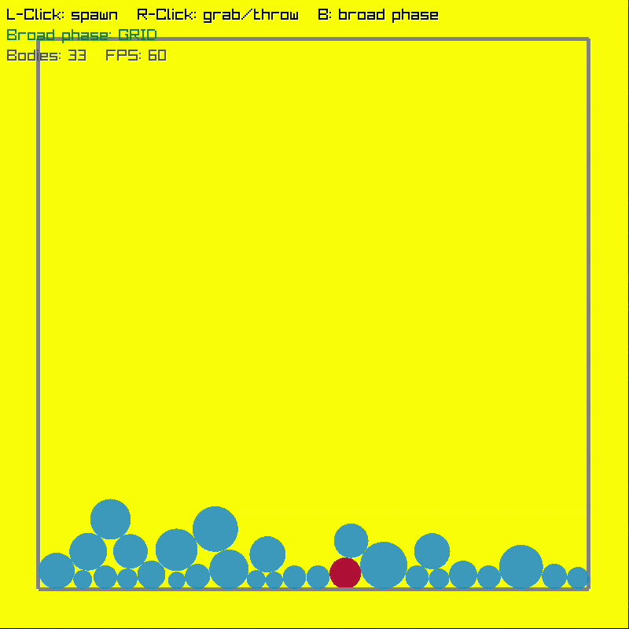

# 2D Physics Engine

A small CPU 2D rigid-body engine in C++17, with [raylib](https://www.raylib.com/)
for the window and drawing. Circles fall under gravity, collide with each other
and with static line-segment walls, and can be spawned and thrown with the
mouse. The headline feature is a **uniform-grid broad phase** that replaces the
naive O(n²) pair check, benchmarked side by side.



## Features

- Semi-implicit (symplectic) Euler integration.
- Circle–circle and circle–segment collision detection (`Manifold`: normal + depth).
- Impulse-based resolution with restitution and positional correction.
- **Fixed timestep** (1/120 s) with an accumulator and frame-time clamping, so the
  simulation is deterministic and stable regardless of render FPS.
- **Adaptive sub-stepping** so fast bodies can't tunnel through thin walls: each
  fixed step is split so nothing moves more than half the smallest radius per
  sub-step (slow scenes stay at one sub-step, so there's no cost when idle).
- Configurable solver iterations (default 8) so stacked bodies settle instead of sinking.
- Off-screen culling: balls that leave the window are discarded so they aren't
  counted or simulated forever (static walls are never culled).
- **Uniform-grid / spatial-hash broad phase**, with the naive O(n²) path kept behind
  a runtime toggle for comparison.
- Headless benchmark mode.

## Layout

```text
include/   Vec2.h  Body.h  Collision.h  World.h      -- public headers
src/       Body.cpp  Collision.cpp  World.cpp        -- engine (static lib)
app/       main.cpp                                  -- window, input, render, bench
CMakeLists.txt
```

`World` owns the bodies and exposes `step(dt)`, `addBody()`, and `queryPoint()`;
`app/main.cpp` only does input and rendering.

## Build

Requires a C++17 compiler and CMake ≥ 3.16. raylib is used if installed, otherwise
fetched and built automatically via `FetchContent`.

```bash
cmake -S . -B build -DCMAKE_BUILD_TYPE=Release
cmake --build build -j
./build/engine            # interactive sandbox
```

Builds warning-free with `-O2 -Wall -Wextra`.

## Controls

| Input | Action |
|-------|--------|
| Left click | Spawn a ball at the cursor |
| Right click | Grab the ball under the cursor |
| Right drag | Throw it (release to fling) |
| `B` | Toggle broad phase (grid ↔ naive) |
| `Esc` | Quit |

## Benchmark

`World` is advanced headlessly (no window), timing both broad phases on the
identical deterministic scene. A self-test first asserts both paths find the
exact same set of colliding pairs.

```bash
./build/engine --bench N [steps]   # default steps = 1000
```

Results below: single thread, g++ 13.3 `-O2`, 800×800 box, radii 8–16 px, 8 solver
iterations. The metric is average **ms per fixed step** (60 FPS budget = 16.67 ms).

| Bodies (N) | Naive O(n²) | Grid | Speed-up |
|-----------:|------------:|-----:|---------:|
| 500        |   3.39 ms   | 0.30 ms | 11.3× |
| 1000       |  12.49 ms   | 0.57 ms | 22.0× |
| 2000       |  54.25 ms   | 1.09 ms | 49.9× |
| 5000       | 339.88 ms   | 9.47 ms | 35.9× |

_(500–2000 at 1000 steps; 5000 at 100 steps. ms/step is step-count independent.)_

**Max bodies holding 60 FPS (≤ 16.67 ms/step):**

- Naive O(n²): **~1000 bodies** (12.5 ms at 1000, 21.6 ms at 1200).
- Grid: **~7000 bodies** (9.4 ms at 5000, 18.8 ms at 8000).

In this fixed box the grid eventually degrades as cells overfill — its worst case is
still O(n²) when everything lands in one cell — but it sustains roughly **7×** the
body count of the naive path at interactive rates.

## How it works

- **Impulse:** `j = -(1 + e) · (v_rel · n) / (invMassA + invMassB)`, applied along the
  contact normal; `e` is the lower of the two restitutions.
- **Positional correction** separates overlap each step (weighted by inverse mass) so
  bodies don't sink into each other under constant gravity.
- **Fixed timestep** decouples physics from render rate for determinism and stability;
  the accumulator runs as many 1/120 s steps as the frame covers, clamped so a stall
  can't trigger a death spiral.
- **Sub-stepping (anti-tunnelling):** walls are zero-thickness segments, so a body
  moving more than ~a radius per step could pass through one between frames. Each fixed
  step is subdivided so no body moves more than half the smallest radius per sub-step,
  which guarantees at least one overlapping sub-step on any crossing.
- **Grid broad phase:** cell size = 2 × max radius. Each body is inserted into every
  cell its AABB overlaps, and only bodies sharing a cell are narrow-phase tested. Any
  two overlapping AABBs necessarily share a cell, so no real contact is missed —
  verified by the naive-vs-grid pair assertion. Average cost is ~O(n); worst case
  O(n²) when all bodies cluster in one cell.
